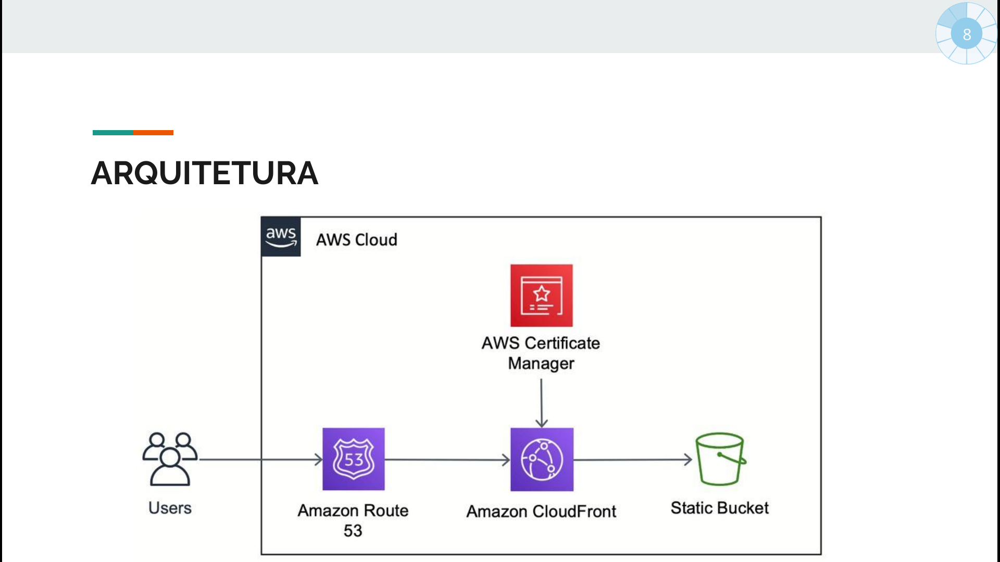

# Site Estático de Currículos Profissionais

Este projeto consiste em um site estático que exibe cards com currículos de profissionais, contendo um breve resumo, link para o LinkedIn e opção de download do currículo completo. O site está disponível no domínio [edntcc.cloud](https://edntcc.cloud).

## Tecnologias Utilizadas

- HTML
- CSS
- JavaScript

## Funcionalidades

- Exibe cards com currículos de profissionais.
- Cada card contém um resumo do currículo, um link para o perfil do LinkedIn do profissional e um botão para fazer o download do currículo completo.

## Integração com Serviços de Nuvem

O projeto utiliza os seguintes serviços de nuvem:

- **Bucket S3:** O site estático é hospedado em um bucket S3 da AWS. Os arquivos HTML, CSS, JavaScript e as imagens são armazenados neste bucket.
- **CloudFront:** O CloudFront é utilizado como uma CDN (Content Delivery Network) para distribuir o conteúdo do site de forma rápida e eficiente.
- **AWS Certificate Manager:** O Certificado SSL fornecido pelo AWS Certificate Manager é utilizado para habilitar o acesso seguro ao site através do protocolo HTTPS.
- **Route 53:** O Route 53 é utilizado como serviço de DNS para associar o domínio `edntcc.cloud` ao bucket S3 e ao CloudFront.

## Estrutura do Projeto

O projeto possui a seguinte estrutura de arquivos:

- `index.html`: Página inicial do site.
- `styles.css`: Arquivo CSS com estilos personalizados.
- `script.js`: Arquivo JavaScript para funcionalidades interativas.
- `images/`: Pasta contendo as imagens utilizadas no site.

## Como Executar o Projeto Localmente

Para executar o projeto localmente, siga as etapas abaixo:

1. Clone este repositório para o seu ambiente de desenvolvimento.
2. Abra o arquivo `index.html` em um navegador web.
3. O site será exibido com os cards de currículos dos profissionais.

## Contribuição

Contribuições são bem-vindas! Se você deseja fazer melhorias neste projeto, siga as etapas abaixo:

1. Faça um fork deste repositório.
2. Crie uma nova branch para as suas alterações: `git checkout -b minha-feature`.
3. Faça as alterações desejadas e salve-as.
4. Faça o commit das suas alterações: `git commit -m 'Adicionar minha feature'`.
5. Envie as alterações para o seu fork: `git push origin minha-feature`.
6. Crie um pull request para este repositório original.

## Licença

Este projeto está licenciado sob a [MIT License](LICENSE).

